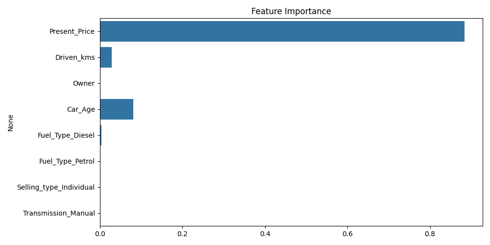
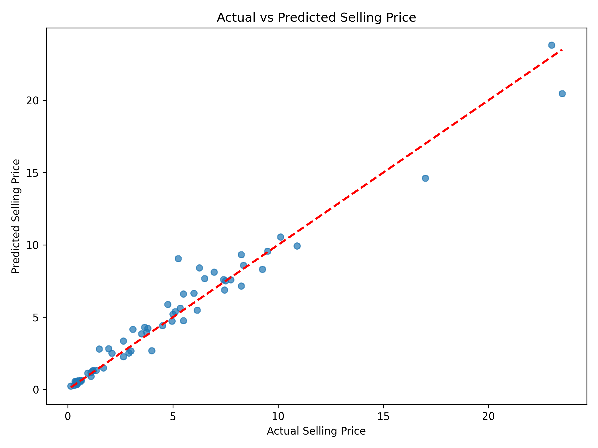
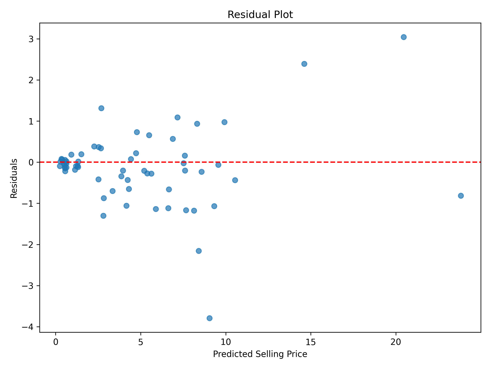

# 🚗 Car Price Prediction using Machine Learning


---

# 📌 Project Overview

This project predicts the selling price of used cars using Machine Learning regression algorithms.

The objective is to build a highly accurate regression model capable of estimating the resale value of a vehicle based on its characteristics such as manufacturing year, present price, fuel type, transmission, seller type, driven kilometers, and ownership history.

This project was developed as part of the **CodeAlpha Data Science Internship**.

---

# ⭐ Key Features

* Data Cleaning & Preprocessing
* Feature Engineering (Car Age)
* Exploratory Data Analysis (EDA)
* Comparison of Multiple Regression Algorithms
* Hyperparameter Tuning using RandomizedSearchCV
* Model Evaluation using MAE, RMSE and R² Score
* Feature Importance Visualization
* Actual vs Predicted Analysis
* Residual Analysis
* Model Saving using Joblib
* Future Price Prediction

---

# 📂 Dataset Information

**Dataset:** Used Car Price Prediction

**Source:** Kaggle

**Records:** 301

**Target Variable:** Selling_Price

---

# 🎯 Problem Statement

The resale value of a used vehicle depends on multiple factors such as manufacturing year, fuel type, transmission type, ownership history and vehicle condition.

The goal of this project is to build a Machine Learning model capable of predicting the expected selling price of a used car with high accuracy.

---

# 🔄 Project Workflow

```text
Dataset
    │
    ▼
Data Preprocessing
    │
    ▼
Exploratory Data Analysis
    │
    ▼
Feature Engineering
    │
    ▼
Train-Test Split
    │
    ▼
Model Training
    │
    ▼
Model Evaluation
    │
    ▼
Best Model Selection
    │
    ▼
Save Model
    │
    ▼
Price Prediction
```

---

# 📁 Project Structure

```text
CodeAlpha-Car-Price-Prediction/
│
├── data/
│   └── car data.csv
│
├── images/
│   ├── selling_price_distribution.png
│   ├── correlation_heatmap.png
│   ├── boxplot.png
│   ├── feature_importance.png
│   ├── actual_vs_predicted.png
│   └── residual_plot.png
│
├── models/
│   └── car_price_model.pkl
│
├── notebook/
│   └── Car_Price_Prediction_EDA.ipynb
│
├── reports/
│   └── Car_Price_Prediction_Report.pdf
│   
│
├── src/
│   ├── train_model.py
│   ├── predict.py
│   └── data_preprocessing.py
│
├── README.md
├── requirements.txt
├── LICENSE
└── .gitignore
```
---

# ⚙️ Technologies Used

* Python
* Pandas
* NumPy
* Matplotlib
* Seaborn
* Scikit-Learn
* Joblib
* Jupyter Notebook
* VS Code

---

# 📊 Exploratory Data Analysis

The dataset was analyzed using several visualization techniques.

* Selling Price Distribution
* Correlation Heatmap
* Selling Price by Fuel Type
* Feature Importance
* Actual vs Predicted Plot
* Residual Plot

---

# ⚙️ Data Preprocessing

The following preprocessing steps were performed:

* Missing Value Check
* Feature Engineering (Car Age = 2026 − Manufacturing Year)
* One-Hot Encoding
* Removal of Unnecessary Columns
* Train-Test Split (80:20)

---

# 🤖 Machine Learning Models

The following regression algorithms were trained and compared:

* Linear Regression
* Decision Tree Regressor
* Random Forest Regressor
* Gradient Boosting Regressor

---

# 📈 Model Performance

| Model                 |        MAE |       RMSE |   R² Score |
| --------------------- | ---------: | ---------: | ---------: |
| Linear Regression     |     1.2164 |     1.8658 |     0.8487 |
| Decision Tree         |     0.6966 |     1.0454 |     0.9526 |
| Random Forest         |     0.6369 |     0.9664 |     0.9595 |
| **Gradient Boosting** | **0.5899** | **0.9394** | **0.9617** |

---

# 🏆 Best Model

Gradient Boosting Regressor achieved the best prediction accuracy.

**Performance**

* MAE : **0.5899**
* RMSE : **0.9394**
* R² Score : **0.9617**

The trained model was saved as:

```text
models/car_price_model.pkl
```

---

# 📌 Project Outputs

The project successfully generates:

* Trained Machine Learning Model (`models/car_price_model.pkl`)
* Selling Price Prediction
* Model Evaluation Metrics
* Feature Importance Analysis
* Actual vs Predicted Comparison
* Residual Analysis
* EDA Visualizations

---

# 📷 Project Visualizations

## Selling Price Distribution


---

## Correlation Heatmap


---

## Selling Price by Fuel Type


---

## Feature Importance



---

## Actual vs Predicted



---

## Residual Plot



---

# ▶️ Installation

Clone the repository

```bash
git clone https://github.com/YOUR_USERNAME/CodeAlpha-Car-Price-Prediction.git
```

Install dependencies

```bash
pip install -r requirements.txt
```

---

# 🚀 Usage

Train the model

```bash
python src/train_model.py
```

Predict selling price

```bash
python src/predict.py
```

---

# 🔮 Future Improvements

* Hyperparameter Optimization using GridSearchCV
* K-Fold Cross Validation
* Deployment using Streamlit or Flask
* Cloud Deployment (AWS / Azure)
* Larger Dataset for Better Generalization

---

# 👨‍💻 Author

**Rawal JayKumar NarendraKumar**

Data Science & Machine Learning Enthusiast

CodeAlpha Data Science Internship

---

# 📜 License

This project is licensed under the MIT License.
